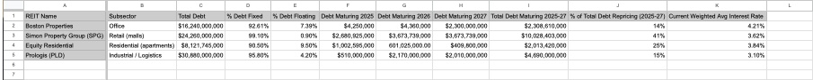

# The 2025–2027 Refinancing Wall  
**Corporate Debt Maturity Risk & Liquidity Stress Test**

**View-Only Model (Google Sheets):**  
https://docs.google.com/spreadsheets/d/1UIf8hAUptJh2spfXuyrhGxHV_eaP7zasBhPn-DdrDIo/edit?usp=sharing

---

## Business Question
Which companies face the greatest refinancing risk between 2025–2027 if interest rates remain elevated, and what balance-sheet characteristics determine survivability versus distress?

This project evaluates how debt maturity concentration, higher refinancing rates, and liquidity constraints interact to create asymmetric refinancing risk across companies.

---

## Why This Matters
A significant volume of corporate debt was issued during the ultra-low-rate environment of 2020–2021. As this debt matures between 2025–2027, companies must refinance at materially higher interest rates.

For FP&A, treasury, and strategy teams, the risk is not abstract:
- Interest expense can reset sharply higher  
- Coverage ratios can deteriorate rapidly  
- Liquidity buffers can compress faster than expected  

This analysis mirrors how finance teams stress-test balance sheets under adverse capital-market conditions.

---

## Analytical Framework
The model is structured as a refinancing feasibility and liquidity stress test:

- Debt maturity mapping across the 2025–2027 window  
- Interest expense shock under higher-rate refinancing scenarios  
- Coverage, leverage, and liquidity pressure analysis  
- Scenario-based assessment of refinancing viability  

The objective is to identify **who breaks first — and why**.

---

## Analytical Tooling & Validation
The analysis combines spreadsheet-based modeling with Python-driven validation:

- Google Sheets used for debt schedules, refinancing scenarios, and liquidity modeling  
- Python used to normalize assumptions, compare outcomes across firms, and stress-test sensitivity to rate changes  

This hybrid workflow reflects how finance teams validate spreadsheet conclusions with programmatic checks rather than replacing judgment with automation.

---

## Key Assumptions
- Interest rates remain structurally higher through the refinancing window  
- Companies cannot refinance at prior low-rate terms  
- Liquidity preservation is prioritized over growth investment  
- Capital markets remain selective rather than fully closed  

Assumptions are intentionally conservative to test downside survivability.

---

## Key Findings
- Refinancing risk is driven more by **maturity concentration and liquidity** than by headline leverage alone  
- Companies with near-term maturities and thin liquidity buffers face disproportionate risk  
- Interest expense shocks materially compress coverage ratios even for firms with stable operating performance  
- Balance-sheet flexibility, not revenue growth, is the primary determinant of refinancing survivability  

---

## Decision Implications
- Treasury teams should prioritize maturity extension and liquidity preservation well ahead of refinancing cliffs  
- FP&A teams must incorporate refinancing costs into forward cash-flow planning  
- Capital allocation decisions should account for refinancing risk before pursuing aggressive growth or buybacks  
- Not all leverage is equal — timing and liquidity matter more than absolute debt levels  

This project demonstrates how finance teams translate macro conditions into actionable balance-sheet risk assessment.

---

## Repository Contents (At a Glance)
- `assets/` — Executive screenshots illustrating refinancing risk, interest shocks, and liquidity stress  
- `memo/` — Executive summary outlining key conclusions and implications  
- `scripts/` — Python-based stress testing and comparative analysis  

The primary analytical model is maintained in Google Sheets and linked above.

---

## Appendix: Model Screenshots (Executive Review Views)

*Screenshots reflect executive-level outputs and decision-support views.*

### Debt Maturity Profile (2025–2027)

### Refinancing Risk Classification (Red Zone Analysis)

### SOFR & Interest Rate Assumptions

### Stress Test Results (Liquidity & Coverage Impact)

